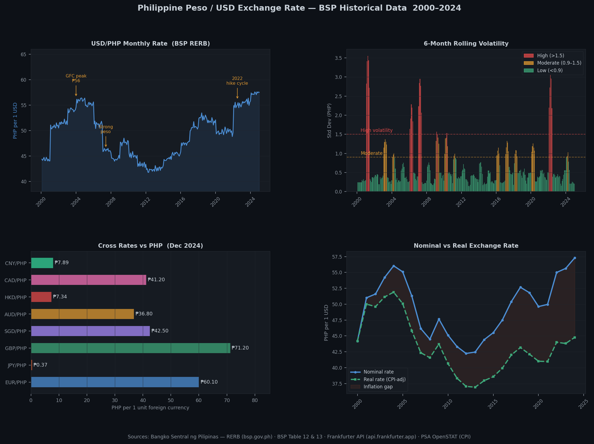

# ph-fx-dashboard

**Live BSP peso-dollar tracker with volatility alerts — built for Filipino SME exporters and freelancers.**

Scrapes daily exchange rates from the Bangko Sentral ng Pilipinas, stores them in PostgreSQL, transforms with dbt, and surfaces a Streamlit dashboard with volatility alerts and an SME margin calculator — all running locally with a single `docker compose up`.

[](https://www.python.org/)
[](https://www.postgresql.org/)
[](https://docs.getdbt.com/)
[](https://streamlit.io/)

> **Companion data warehouse → [ph-economic-tracker](https://github.com/raldisk/ph-economic-tracker)**
> Feeds GDP, CPI, and remittance context that grounds the FX analysis in macroeconomic fundamentals.

---

## Preview



> Four views from the mart tables: USD/PHP monthly rate 2000–2024 with key event annotations · 6-month rolling volatility with BSP-regime colour coding · Cross rates vs PHP (8 currencies, Dec 2024) · Nominal vs real exchange rate showing the inflation-adjusted peso strength gap.

---

## Why this project

A 2–3 peso swing in USD/PHP can wipe out a month's margin on a $10,000 USD freelance contract — that's ₱20,000–₱30,000 gone. The BSP publishes daily rates but they are buried in static HTML tables and XLSX bulletins. This pipeline makes that data queryable, alertable, and visual.

---

## Quickstart

```bash
git clone https://github.com/raldisk/ph-fx-dashboard.git
cd ph-fx-dashboard

cp .env.example .env

# Start PostgreSQL
docker compose up postgres -d

# Run full ingestion + dbt transforms
docker compose run --rm app ingest

# Launch dashboard
docker compose up streamlit -d
```

Open **http://localhost:8501** — the dashboard reads live from PostgreSQL mart tables.

---

## Architecture

```
┌──────────────────────────────────────────────────┐
│          Ingestion Layer (Python)                │
│  ingestion/bsp_rerb.py     · daily XLSX scrape  │
│  ingestion/bsp_historical.py · Table 12 + 13    │
│  ingestion/frankfurter.py  · fallback JSON API  │
│  Pydantic v2 validation on every FXRate record  │
└──────────────────────┬───────────────────────────┘
                       │ upsert ON CONFLICT (date, pair)
                       ▼
┌──────────────────────────────────────────────────┐
│         PostgreSQL 16                            │
│  raw.fx_daily       raw.fx_monthly               │
│  raw.cross_rates    raw.cpi_monthly              │
└──────────────────────┬───────────────────────────┘
                       │ dbt run
                       ▼
┌──────────────────────────────────────────────────┐
│         dbt marts                                │
│  fx_dashboard        · KPIs + trend              │
│  fx_volatility       · 30-day rolling std dev    │
│  real_exchange_rate  · nominal adjusted for CPI  │
└──────────┬───────────────────────┬───────────────┘
           ▼                       ▼
   Streamlit (live)         Power BI / Tableau
   Alerts + calculator      Export reports
```

---

## Dashboard features

- **Metric cards** — current rate, 30-day avg, YTD high/low, 30-day volatility
- **Dual-axis chart** — USD/PHP rate + rolling volatility overlay
- **Cross-rate table** — EUR, JPY, GBP, SGD, AUD, HKD, CAD, CNY vs PHP
- **Volatility alert** — banner fires when rate moves > user-set % threshold in 24h
- **SME margin calculator** — enter USD contract value → PHP equivalent at current / historical / forecasted rate
- **Real exchange rate** — nominal FX adjusted for PH vs US CPI differential

---

## CLI reference

```bash
ph-fx ingest                  # fetch BSP + Frankfurter → PostgreSQL → dbt
ph-fx ingest --source bsp     # BSP only
ph-fx ingest --source frankfurter  # fallback API only
ph-fx transform               # run dbt models only
ph-fx status                  # show latest rates + row counts
```

---

## Data Sources & Citations

All data is sourced from official institutions and free public APIs. No API key required for the primary BSP source.

| # | Series | Agency | Frequency | Access Method | URL |
|---|---|---|---|---|---|
| 1 | USD/PHP daily closing rate (RERB) | Bangko Sentral ng Pilipinas | Daily | Static HTML table / XLSX scrape | [bsp.gov.ph/statistics/external/exchrates.aspx](https://www.bsp.gov.ph/statistics/external/exchrates.aspx) |
| 2 | USD/PHP daily rate (live table) | Bangko Sentral ng Pilipinas | Daily | HTML table (`requests` + `BeautifulSoup`) | [bsp.gov.ph/statistics/external/day99_data.aspx](https://www.bsp.gov.ph/statistics/external/day99_data.aspx) |
| 3 | USD/PHP historical monthly — Table 12 | Bangko Sentral ng Pilipinas | Monthly | HTML table scrape | [bsp.gov.ph/statistics/external/tab12_pus.aspx](https://www.bsp.gov.ph/statistics/external/tab12_pus.aspx) |
| 4 | Cross rates (EUR, JPY, GBP, SGD, AUD, HKD, CAD) — Table 13 | Bangko Sentral ng Pilipinas | Daily | HTML table scrape | [bsp.gov.ph/statistics/external/tab13_php.aspx](https://www.bsp.gov.ph/statistics/external/tab13_php.aspx) |
| 5 | Multi-currency FX rates (fallback) | Frankfurter API | Daily | JSON REST — no key required | [api.frankfurter.app](https://api.frankfurter.app) |
| 6 | CPI monthly (2018=100) — inflation context | Philippine Statistics Authority | Monthly | PXWeb REST API | [openstat.psa.gov.ph](https://openstat.psa.gov.ph/) |

### Full citation details

**Bangko Sentral ng Pilipinas (BSP) — Reference Exchange Rate Bulletin (RERB)**
> Bangko Sentral ng Pilipinas. *Daily Reference Exchange Rates — Philippine Peso per US Dollar.*
> Retrieved from `https://www.bsp.gov.ph/statistics/external/exchrates.aspx`
> Coverage: 2017–present (daily). Historical monthly series via Table 12 from earlier years.
> Access method: static HTML tables — `requests` + `BeautifulSoup`. No API key required.
> Data is official and freely accessible per BSP's public statistics mandate.

**Frankfurter API — Free Open-Source Exchange Rates**
> Frankfurter. *Historical and current foreign exchange rates.*
> Retrieved from `https://api.frankfurter.app`
> Source: European Central Bank reference rates. Free, no registration, no API key.
> Used as fallback when BSP site is unavailable or undergoing maintenance.
> License: Open, free for any use. No attribution required by provider.

**Philippine Statistics Authority (PSA) — OpenSTAT CPI**
> Philippine Statistics Authority. *Consumer Price Index — All Items (Base Year 2018 = 100).*
> Retrieved from `https://openstat.psa.gov.ph/`
> Coverage: January 2000 – present (monthly). Used to compute real exchange rate (nominal FX adjusted for PH vs US inflation differential).
> Access: PXWeb REST API, no key required.

### Data freshness

| Source | Published | Pipeline refresh |
|---|---|---|
| BSP RERB daily | ~5PM Manila each business day | Daily (GitHub Actions cron `0 9 * * 1-5`) |
| BSP Table 12 historical | Monthly | Monthly |
| Frankfurter fallback | Real-time (ECB reference) | On BSP failure |
| PSA CPI | ~3 weeks after reference month | Monthly |

---

## dbt Models

### Staging
- `stg_fx_rates` — deduplicate, standardize currency pair codes, fill non-trading-day gaps via forward-fill

### Marts
- `fx_dashboard` — daily rate, 7/30/90-day rolling average, YTD min/max
- `fx_volatility` — 30-day rolling standard deviation, annualized volatility
- `real_exchange_rate` — nominal rate adjusted for PH vs US CPI differential

---

## Project structure

```
ph-fx-dashboard/
├── src/ph_fx/
│   ├── ingestion/
│   │   ├── bsp_rerb.py          # daily XLSX scraper
│   │   ├── bsp_historical.py    # Table 12 + 13 HTML scraper
│   │   └── frankfurter.py       # fallback JSON API
│   ├── models.py                # Pydantic v2: FXRate, CrossRate
│   ├── loader.py                # upsert logic
│   ├── alerts.py                # volatility threshold logic
│   └── config.py
├── transforms/
│   └── models/
│       ├── staging/stg_fx_rates.sql
│       └── marts/
│           ├── fx_dashboard.sql
│           ├── fx_volatility.sql
│           └── real_exchange_rate.sql
├── dashboard/app.py             # Streamlit
├── notebooks/fx_eda.ipynb       # EDA + STL decomposition
├── scripts/
│   ├── schedule_ingest.py       # APScheduler daily job
│   └── export_excel.py
├── output/
│   ├── ph_fx_dashboard.pbix     # Power BI
│   └── ph_fx_report.xlsx
├── docs/
│   └── preview.png
├── tests/
├── Dockerfile
├── docker-compose.yml
├── pyproject.toml
├── .env.example
└── README.md
```

---

## Configuration

| Variable | Default | Description |
|---|---|---|
| `PH_FX_POSTGRES_DSN` | `postgresql://fx:fx@localhost:5432/ph_fx` | PostgreSQL connection string |
| `PH_FX_ALERT_THRESHOLD_PCT` | `1.5` | % daily move that triggers volatility alert |
| `PH_FX_START_YEAR` | `2017` | Earliest year to fetch from BSP |
| `PH_FX_FALLBACK_API` | `https://api.frankfurter.app` | Fallback FX API URL |

---

## CI/CD

```yaml
name: Daily FX Ingest
on:
  schedule:
    - cron: '0 9 * * 1-5'     # 5PM Manila = 09:00 UTC (weekdays only)
  push:
    branches: [main]
jobs:
  pipeline:
    runs-on: ubuntu-latest
    steps:
      - uses: actions/checkout@v4
      - uses: actions/setup-python@v5
        with: { python-version: '3.11' }
      - run: pip install -r requirements.txt
      - run: pytest tests/ -v
      - run: dbt test --profiles-dir transforms
```

---

## License

MIT
